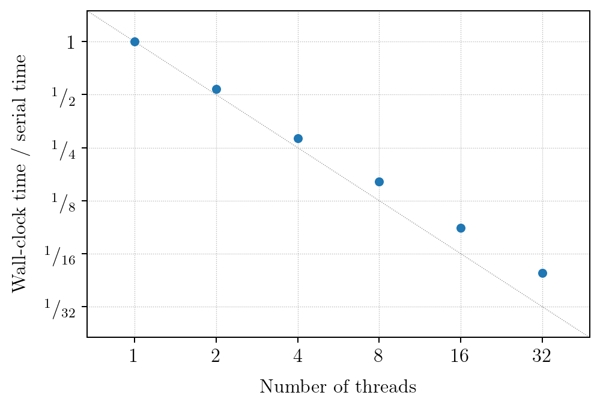
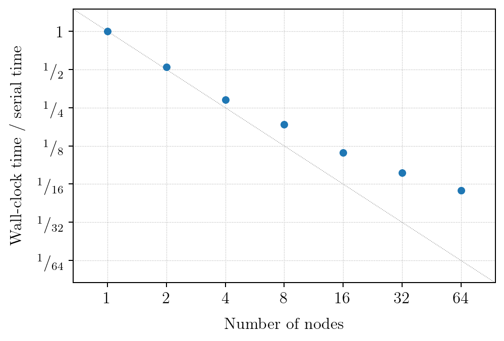

Performance scaling
###################

The computation time in Magritte is dominated by the computation of the radiation field.
This is computed by solving the radiative transfer equation for each ray through each point
and in each frequency bin. Schematically this computation can be written as:

.. code-block:: C++

    for(direction : directions)
    {
        for(point : points)
        {
            Ray_pair ray_pair = trace (direction, point);

            for(frequency : frequencies)
            {
                solve_radiative_transfer (ray_pair, frequency);
            }
        }
    }

The parallelisation in Magritte is an hybrid between MPI and OpenMP.
The outer loop over the directions is parallelised with MPI,
while the middle loop over the points is parallelised with OpenMP.
The inner loop over the frequencies is ideally suited for vectorisation.

Multi-threading (OpenMP)
************************

The figure above shows a strong scaling plot for the multi-threading using OpenMP in Magritte.

Message passing (MPI)
*********************

   
The figure above shows a strong scaling plot for the message passing using MPI in Magritte.
