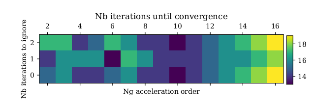
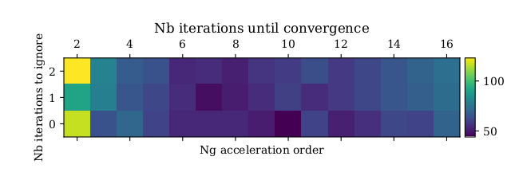

Adaptive Ng-acceleration in Magritte
====================================

For optically thick media, computing NLTE line radiative transfer involves a slow, iterative convergence process.
Ng-acceleration helps to speed this up by extrapolating the changes in the computed level populations.
When applying Ng-acceleration, the following steps take place:
First, one computes the level populations for N default radiative transfer iterations. Afterwards, one extrapolates the computed level populations.
This is repeated until the level populations are converged. To change the number of iterations between each Ng-acceleration step (= order of Ng-acceleration), one can call

.. code-block:: python

   parameters.Ng_acceleration_mem_limit = N #(default = 6)

In Magritte, we make two modifications to Ng-acceleration:

1. We allow the Ng-acceleration to happen earlier than every N steps, if the relative change in level populations caused by the Ng-acceleration step
would be less than the relative change when comparing the current level populations with the level populations of the previous iteration. In our experience, this allows the first Ng-acceleration step to happen earlier.
To disable this behavior, one can call

.. code-block:: python

   parameters.use_adaptive_Ng_acceleration = False #(default = True)

2. We can allow the Ng-acceleration to ignore the first iteration (and the first iteration after each Ng-acceleration step) when computing the extrapolation.
As Ng-acceleration implicitly assumes some kind of linearity for the convergence for the level populations, pruning the first step can improve the convergence behavior.
To change the number of iterations M which we exclude from Ng-acceleration, one can set

.. code-block:: python

   parameters.Ng_acceleration_remove_N_its = M #(default = 1)

.. note::

   These settings have been obtained by figuring out which options result in the fastest convergence for the optically thick Van Zadelhoff (2002) benchmarks.
   See the tables below for a more informed decision on how these parameters might influence the computation time.

   Amount of iterations required for convergence for the Van Zadelhoff 1a model.

   Amount of iterations required for convergence for the Van Zadelhoff 1b model.
