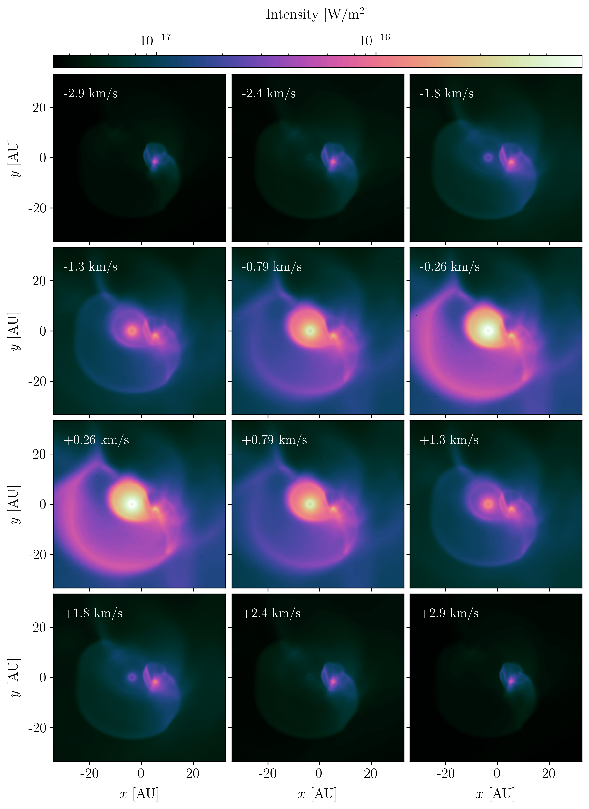

# Summary

Magritte is modern software library for radiative transfer, with a particular focus
on atomic and molecular lines, and specific functionality to generate synthetic
observations. The radiation field is computed with a deterministic ray-tracer and
formal solver, i.e. rays are traced through the model and the radiative transfer
equation is solved along those rays `[@DeCeuster:2019]`. This is in contrast to most
radiative transfer solvers which employ Monte Carlo techniques `[@Noebauer:2019]`.
Magritte can handle structured and unstructured meshes, as well as smoothed-particle
hydrodynamics (SPH) data, and provides tools to optimize these different input data
for radiative transfer `[@DeCeuster:2020]`. Magritte can either be used as a Python
package or as a C++ library.

# Statement of need

Electromagnetic radiation is a key component in almost all astrophysical simulations.
Not only does it dictate what we can or cannot observe, it can provide e.g. radiation
pressure and efficient heating and cooling mechanisms in hydrodynamics, and opens up
a range of new chemical pathways due to photo-reactions.
Magritte can be used as a general-purpose radiation transport solver, but was
particularly designed for applications in 3D stellar wind modelling. These simulations
model the hydrodynamical and chemical evolution of the outer layers of evolved stars
as they loose their mass, enriching the interstellar medium `[see e.g. @Decin:2021]`.
Recent high-resolution observations exposed the intrinsically 3D complex morphologies
formed by these outflows `[@Decin2020]`, necessitating the use of 3D hydrodynamical/chemical
models `[@ElMellah:2020; @Bolte:2021; @Maes:2021; @Malfait:2021]`.
Currently Magritte is mainly being used for post-processing these hydrodynamical/chemical
simulations by creating synthetic observations of the models such that they can be
compared with actual observations (see \autoref{fig:example}). In future work
we aim to clear the path for on-the-fly radiative transfer in those simulations.

# Future work

Magritte is still under active development.
Aside from being a practical research tool, Magritte also aims to be a foundation 
for future research in computational radiative transfer. Current active research
topics include: efficient parallelisation and acceleration strategies on modern
high-performance computing systems, acceleration of convergence in the non-linear
coupling between the radiation field and the medium, and uncertainty quantification
in radiative transfer through probabilistic numerical methods.

# Acknowledgements

FDC is supported by the EPSRC iCASE studentship programme, Intel Corporation and Cray Inc.
FDC and LD acknowledge support from the ERC consolidator grant 646758 AEROSOL.

# References
